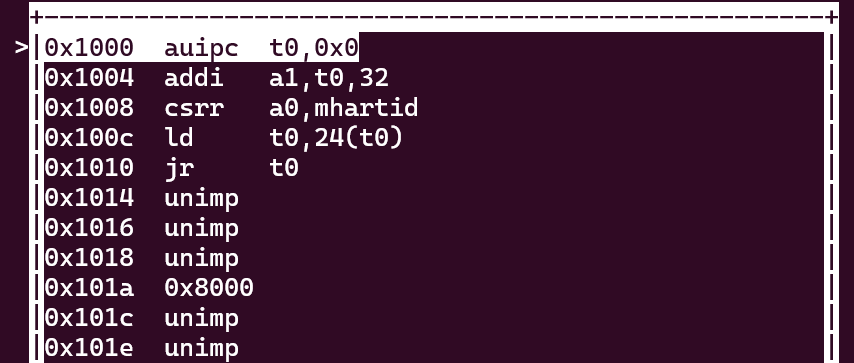

# Lab 0.5 
## 使用GDB验证启动流程
### 加电后的固化跳转
启动调试环境后，汇编代码如图：

- 指令 `auipc t0,0x0` 将此时 pc 寄存器中值（**0x0000000000001000**）的高位存放于 t0, 结合指令`addi a1,t0,32`， t0 中值为 **0x0000000000001000**, a1 中值为 **0x0000000000001020**

- 指令`csrr a6,mahartid` 从 `mhartid` 这个 `CSR` 中读取数据，并将数据存入 `a6` 寄存器。
  - `csrr` 为汇编伪指令，该语句会被翻译为 `csrrw x0,mahartid,a6`。
  - `a6` 为通用寄存器
  - `mhartid` 是一个 Machine Information Registers 类别的CSR，代表 “Machine Hardware Thread ID”。这个寄存器用于存储当前硬件线程的ID，可以帮助操作系统识别和管理不同的硬件线程。

- 指令 `ld t0,24(t0)`, `jr t0`, 将地址**0x0000000000001018** 处的值存放到寄存器 t0 中，并进行跳转。

| 地址 |指令 |功能 | 执行指令后相关寄存器中的值 |
| - | - | - | - |
| 0x1000 | auipc t0,0x0 | 将pc的值加上0，存入t0寄存器中| t0=0x1000 |
| 0x1004 | addi a1,t0,32 | t0的值加上32，存入a1 | a1=0x1020 |
| 0x1008 | csrr a0, mhartid | 将当前硬件线程的ID（hartid）加载到寄存器a0中。mhartid是一个CSR寄存器，它记录了当前硬件线程的唯一标识符 | a0=0 |
| 0x100c | ld a1,24(t0) | 把t0+24所表示的地址的值存入a1寄存器中 | t0=0x80000000, a1=0x1020 |
| 0x1010 | jr t0 | 跳转至t0所表示的地址处 | t0=0x80000000 |

### 运行 opensbi 程序初始化
RISC-V 计算机加电加载 opensbi 代码如图：
  
  按照调试过程，将语句作用分为：
#### 判断 hardware thread id 重定位
  - 指令`csrr a6,mahartid`, `bgtz a6,0x80000108` 即获得当前执行线程，非主线程（ thread id = `0`）则跳转至地址 `0x80000108`  处。该指令通过原子指令来设置地址_relocate_lottery 处的值来决定哪一个cpu来做重定位和初始化。没能抢到锁的cpu到地址_wait_relocate_copy_done 处反复循环，等待抢到锁的cpu（即主cpu）完成重定位。
  
> 链接地址：该文件链接时假定自己会被加载到的地址（通常情况下应该是一样的）
> 
> 加载地址：该文件被实际加载到的物理地址

- 如果两者不一致就需要进行重定位。在 `fw_jump.elf` 中的重定位中只是简单地把所有的加载到load address 里的内容，复制到 link address 里。
此时链接地址 t0=0x80000000，加载地址 t2=0x80000000，而 0x80000046 的指令为beq t0,t2, 0x8000014e，此时t0=t2，即链接地址与加载地址一致，不需要重定位，因此跳过。

- bgtz a6, 0x80000108 判断a6是否为0，如果为0 则表明上述代码时第一次执行，这个core需要去完成重定位搬运，其他后来的core需要去等这个过程完成。此时a6为0，不跳转。
    
    

#### 同步读写后清除寄存器值

跳转到 `0x8000014e` 代码段如下：
  

  - `sd t1,0(t0)` 在`0x80000408` 存放 1 
    
  - `fence rw,rw` 对设备 I / O 和 内存访问 等进行串行化。
  - 跳转到 `0x80000550` 执行 `fense.i` 指令同步指令 和 数据流, 将所有寄存器值清零，写mscratch寄存器为 0，返回到 `0x80000166`
      - `fence.i` ：是在其之前的所有指令执行完成后，强制刷新指令缓存（Instruction Cache）和指令队列（Instruction Queue），并确保所有对指令内存的修改都已经提交。这样，后续的指令可以正确地从指令内存中加载，并按照正确的顺序执行。
  - 保存所有参数寄存器的值后跳转到 `0x80000590`

#### 初始化栈
  1. 在调试过程中返回跳转到 `0x8000017e`
  2. 从地址 `0x80009610`, `0x80009614` 读取 无符号字 到 s7、 s8 寄存器
  
  3. 将 `0x0000000080000000`, `0x000000000001c000` 分别存储到 `0x000000008001be00` 的连续地址
  - 保存参数寄存器的值，并跳转到 `0x800005a0` , 返回时返回值为 `0x82200000` , 将该值存储在地址 `0x8001be10` 处。
  4. 保存参数寄存器的值，并跳转到 `0x800005b0` , 返回地址`0x800005d0`存储的值 `0x80200000` , 将该值存储在地址 `0x8001be18` 处。
  5. 保存参数寄存器的值，并跳转到 `0x800005c0` , 返回值 `1` 并存储在地址 `0x8001be20` 处。
  6. 将值 **0x8000039e** 存储在 `0x8001be28`, **0x800095c0** 存储在 `0x8001be30`,  **0x80000428** 存储在 `0x8001be38`,  **0x0** 存储在 `0x8001be40`
  7. 保存参数寄存器的值，并跳转到 `0x800005c8` , 返回值 `0` 并将返回值和 0 或运算的结果存储在地址 `0x8001be48` 处。
  8. 跳转到 `0x800001b8`。 将 3-7 存储操作一共完成 8 次。 初始化到 tp 值为`0x8000de00`
  
#### 设置寄存器、硬件设备的配置信息重定位
  - 在 `0x8000b000` 到 `0x8000b0b8` 处存储区域清零。 
  - 跳转到 `0x80000362`, 读取 `0x1020`起始32 Byte 的数据复制存储到 `0x82200000`， 存储 2 于地址 `0x80000408`。
  - 同步读写。清零控制中断使能与查询中断寄存器。 设置硬件线程上下文空间的指针为初始化过后数据的地址（`0x000000008001be00`）,  设置异常处理寄存器地址为 `0x0000000080000470`, 重复读异常处理器直至其写入完成。
  
  - 跳转至 `0x800005e2` 后保存保留寄存器值，再跳转至 `0x80004984` 
  - 在 `0x80004bd4` 设置 `scounteren`
  - 在 `0x80005f9e`, `0x80005f2c` 重复执行，基于 `sp` 初始化, 同样基于 a0-a7 寄存器将 硬件设备的配置信息重定位。
  - 从 `0x80006746` 初始化 32 个浮点寄存器

    
