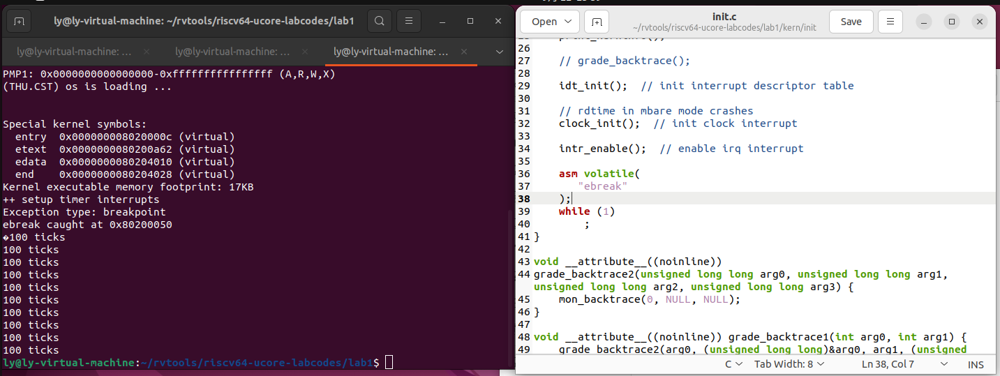

# lab1

## 练习1：理解内核启动中的程序入口操作

问题：阅读 kern/init/entry.S 内容代码，结合操作系统内核启动流程，说明指令 `la sp, bootstacktop` 完成了什么操作，
目的是什么？`tail kern_init` 完成了什么操作，目的是什么？

### 指令`la sp, bootstacktop` 
  指令 `la sp, bootstacktop` 的作用是将寄存器 `sp` 的值设置为 `bootstacktop` 的地址。
  - 在操作系统内核启动流程中，内核需要为自身分配一块栈空间，用于执行内核代码过程中的函数调用、中断处理等操作。由于内核启动时无法确定栈空间的大小，因此需要在启动时为内核分配一个足够大的栈空间，以确保内核在运行过程中不会因为栈溢出等问题而崩溃。
  - 通过查看汇编代码可知，entry.s文件对应的汇编码为`auipc	sp,0x4`，作用为PC的当前值加上**0x4000**，因此`sp`的值变为**0x80204000**；下一条指令为`mv sp, sp`，`sp`中的值无变化。
  - 该指令目的就是将栈空间的起始地址设置为 `bootstacktop`，从而为内核分配一块栈空间。这条指令将 `sp` 寄存器设置为 `bootstacktop` 的地址，即把 `sp` 指向了栈空间的顶部。

### 指令 `tail kern_init`
 指令 `tail kern_init` 是一个汇编语言的跳转指令，它的作用是跳转到 `kern_init` 函数的入口地址
  - 查看汇编代码可知，通过`j	0x8020000c <kern_init>`指令跳转到`kern_init` 函数的入口地址
  - 该指令目的是启动内核的初始化过程，即为内核的各个模块进行初始化，并为用户程序的执行做好准备。内核初始化过程中需要进行的操作包括：初始化内存管理、初始化进程管理、初始化设备驱动程序等。这些操作的目的是为内核提供必要的功能和服务，以便用户程序能够正常执行。
  - `tail`伪指令实现了函数尾调用优化，可以在函数返回时直接跳转到另一个函数，而不需要保存和恢复当前函数的栈帧。查看汇编代码可知在`kern_init`函数最后连续使用了`jal`指令跳转到其他函数的地址完成了相应操作。

| 地址 | 汇编代码 |
| - | - |
| 0x8020003c <kern_init+48> |        jal        ra,0x8020006c <cprintf> |
| 0x80200040 <kern_init+52> |        jal        ra,0x802000a0 <print_kerninfo> |
| 0x80200044 <kern_init+56> |       jal        ra,0x80200184 <idt_init> |
| 0x80200048 <kern_init+60> |      jal        ra,0x80200130 <clock_init> |
| 0x8020004c <kern_init+64> |      jal        ra,0x8020017e <intr_enable> |
| 0x80200050 <kern_init+68> |     j        0x80200050 <kern_init+68> ;这条指令是死循环 |
    
## 练习 2：完善中断处理(需要编程)

实现代码：
```
 volatile size_t num = 0;
 case IRQ_S_TIMER:
        /* LAB1 EXERCISE2 : 2113302  */
        /*(1)设置下次时钟中断- clock_set_next_event()
         *(2)计数器（ticks）加一
         *(3)当计数器加到100的时候，我们会输出一个`100ticks`表示我们触发了100次时钟中断，同时打印次数（num）加一
         * (4)判断打印次数，当打印次数为10时，调用<sbi.h>中的关机函数关机
         */
        clock_set_next_event();
        num += 1;
        if (num % TICK_NUM == 0)
        {
            print_ticks();
            if (num == TICK_NUM * 10)
            {
                sbi_shutdown();
            }
        }
        break;
```
实现过程和定时器中断中断处理的流程：在本次时钟中断的处理过程中，首先调用clock_set_next_event()设置下一个时钟中断的位置，然后统计当前时钟中断次数的变量自增1，接下来进入if语句判断，如果当前时钟中断次数为TICK_NUM=100的倍数，则调用函数print_ticks输出一个100ticks，继续判断，如果当前时钟中断次数为TICK_NUM*10，即打印了10次，则调用<sbi.h>中的关机函数sbi_shutdown()函数关机，中断了中断处理的过程。
参考答案代码：
````case IRQ_S_TIMER:
            clock_set_next_event();
            if (++ticks % TICK_NUM == 0) {
                print_ticks();
            }
            break;
````
参考答案写的更简洁一些，但是没有判断打印次数并调用关机函数的部分。参考答案的计数器变量ticks在clock.c文件中由volatile size_t ticks;语句定义；自主实现的代码新定义了计数器变量num，在trap.c文件中由volatile size_t num = 0;定义。


## Challenge1：描述与理解中断流程
问题：描述 ucore 中处理中断异常的流程（从异常的产生开始），其中 `mov a0，sp` 的目的是什么？`SAVE_ALL`中寄存器保存在栈中的位置是怎么确定的？对于任何中断，`__alltraps` 中都需要保存所有寄存器吗？请说明理由

### ucore 中处理中断异常的流程
  - 异常的产生：当发生中断或异常时，处理器会根据异常号跳转到相应的异常处理程序。通过寄存器传递给 OpenSBI 一个“调用编号”，如果编号在 **0-8** 之间，则由 OpenSBI 进行处理，否则交由我们自己的中断处理程序处理。
  - 保存上下文：在进入异常处理程序之前，需要保存当前的上下文，以便在处理完异常后能够正确地恢复执行，包括保存通用寄存器、程序计数器（PC）和其他相关寄存器的值。
  - 中断处理函数：在入口点汇编代码保存完上下文后，调用函数切换到中断处理函数：trap.c中的trap()函数，切换前的上下文被打包成结构体作为参数传递给该函数。在该函数中主要调用trap_dispatch()函数，它根据结构体中cause的值按照不同的中断类型将中断分发给相应函数进行处理。函数interrupt_handler用于处理中断，exception_handler用于处理异常。
  - 恢复上下文：中断处理函数执行完相应的语句后，返回到trapentry.S中，调用RESTORE_ALL恢复上下文，中断处理结束。

### `mov a0，sp` 指令作用
   - 通过查看汇编代码可知，该指令为`0x80200586 <__alltraps+98>:	mv	a0,sp`，这条指令位于`__alltraps`函数中。这个函数会先执行`SAVE_ALL`宏，用于保存所有寄存器的值到栈中，然后执行`mov a0，sp` 指令。因此，该指令目的是将当前栈指针`sp`的值保存到寄存器`a0`中。
   - 这样做的目的是为了在异常处理程序中能够访问到当前的栈指针值，以便能够正确地恢复栈的状态。

### `SAVE_ALL`中寄存器保存在栈中的位置
- `SAVE_ALL` 的原理是：将一整个 `TrapFrame`中断桢 保存在内核栈上。我们现在就处在内核态(S 态)，因此现在的栈顶地址 sp 就指向内核栈地址。
  - 由`SAVE_ALL`宏定义中的具体操作可知，该宏用于在汇编代码中把所有寄存器的值保存到栈中。
  - `csrw sscratch, sp`：将栈指针`sp`的值保存到`sscratch`寄存器中,为了在异常处理程序中能够访问到当前的栈指针值，以便能够正确地恢复栈的状态。
  - `addi sp, sp, -36 * REGBYTES`：将栈指针`sp`的值减去36个寄存器大小的字节数，即为栈指针分配一段空间用于保存寄存器的值。`REGBYTES`是一个常量，表示一个寄存器的字节数。
  - `STORE x0, 0*REGBYTES(sp)`：将寄存器`x0`的值保存到栈指针`sp`所指向的内存位置。`0*REGBYTES(sp)`表示相对于栈指针的偏移量，用于定位寄存器在栈中的位置。`0`为寄存器`x0`的寄存器编号。若要保存其他寄存器，则更改为对应的寄存器编号。
  - 重复上述步骤，直至把32个寄存器都保存到指定位置。

- 由此可知，寄存器保存在栈中的位置是根据寄存器的编号和`REGBYTES`的值计算得出。


### `__alltraps` 中是否需要保存所有寄存器
  - 对于大多数中断，`__alltraps`确实需要保存所有寄存器的值。这是因为中断处理程序需要恢复中断发生时的上下文，以便正确地处理中断并返回到被中断的程序。保存所有寄存器的值可以确保中断处理程序能够正确地恢复被中断程序的状态。
  - 在`trapentry.S` 中我们可以发现，我们保存了32个寄存器的值（其中也包括了`sp`寄存器的值）以及`sstatus`、`sepc`、`sbadaddr`、`scause`这些寄存器的值
  - 保存寄存器主要有两个作用：一个是`trap`根据`sp`指针的位置定位到存中断前寄存器的位置然后分别`load`相应值从而构造出`trapframe`然后执行分发操作，一个是恢复上下文要从相应位置`load`值。给的代码里面恢复上下文并没有恢复所有的`CSR`，因为异常已经处理完了存不存异常原因没什么意义，但是异常处理函数是需要这些寄存器的值的。


## Challenge2：理解上下文切换机制
问题：在 `trapentry.S` 中汇编代码 `csrw sscratch, sp；csrrw s0, sscratch, x0` 实现了什么操作，目的是什么？`save all`里面保存了 `stval scause` 这些 `csr`，而在 `restore all` 里面却不还原它们？那这样 `store` 的意义何在呢？

### 汇编代码的操作和目的
- 指令`csrw sscratch, sp`
  - 将栈指针`sp`的值保存到`sscratch`寄存器中。
  - 目的是为了在异常处理程序中能够访问到当前的栈指针值，以便能够正确地恢复栈的状态。

- 指令`csrrw s0, sscratch, x0`
  - 将`sscratch`寄存器的值保存到`s0`寄存器中，并将`x0`的值写入`sscratch`寄存器。其中`x0`的值恒为0（因此`x0`的值不必入栈）。
  - 目的是为了将`sscratch`寄存器的值保存到栈中，并将其清零，以便在异常处理程序中使用。
  - 将`sscratch`寄存器的值设置为0，这样如果发生递归异常，异常向量会知道该异常是来自内核的。


### 保存了却不还原的意义

- 相关寄存器作用
  - `sscratch`：存储异常处理过程中的临时状态或上下文信息
  - `sstatus`：保存了CPU的状态信息，如中断使能位、虚拟内存使能位等
  - `sepc`：保存了发生异常时的程序计数器值，即异常发生前的指令地址
  - `sbadaddr`：保存了最后一次发生地址错误的地址值
  - `scause`：保存了最后一次异常的原因，如中断、系统调用、页错误等
  - 在`save all`中保存了却不恢复的寄存器为`sbadaddr`（也就是题目中的`stval`）和`scause`


- 因为内核需要读取这些 CSR，且这些寄存器在下次trap的时候会被硬件写入，所以还原了也没有意义


## Challenge3：完善异常中断

### 非法指令异常处理

- 实现方法：
```
case CAUSE_ILLEGAL_INSTRUCTION:
  // 非法指令异常处理
  /* LAB1 CHALLENGE3   YOUR CODE :  2110939*/
  /*(1)输出指令异常类型（ Illegal instruction）
   *(2)输出异常指令地址
   *(3)更新 tf->epc寄存器
   */

	cprintf("Exception type:Illegal instruction\n");
	cprintf("Illegal instruction caught at 0x%08x\n", tf->epc);
  tf->epc=tf->epc+REGBYTES;   //查到的资料：在异常处理程序中软件改变 mepc 指向下一条指令，由于现在 ecall/ebreak（或 c.ebreak）是 4（或 2）字节指令，因此改写设定 mepc=mepc+4（或+2）即可。
  break;
```

- 测试结果


 调试时查看该位置指令显示为0x80200050 <kern_init+68>:        unimp。

### 断点异常指令处理

- 实现方法：

```
case CAUSE_BREAKPOINT:
    // 断点异常处理
    /* LAB1 CHALLENGE3   2110820 :  */
    /*(1)输出指令异常类型（ breakpoint）
     *(2)输出异常指令地址
     *(3)更新 tf->epc寄存器
     */
    cprintf("Exception type: breakpoint\n");
    cprintf("ebreak caught at 0x%08x\n", tf->epc);
    tf->epc += REGBYTES;
    break;
```

- 参考答案：
```
 case CAUSE_BREAKPOINT:
    cprintf("ebreak caught at 0x%016llx\n", tf->epc);
    tf->epc += 2;
    break;
```

- 与参考答案的区别：

参考答案中更新epc寄存器的方法是+2，而我们在代码中实现的方法为+REGBYTES。查看汇编代码可知，每条指令之间的间隔为2，因此更新epc下一条指令直接加上2就好。而我们写的REGBYTES是宏定义的寄存器长度，由机器是否是64位来决定，因此这个写法也是合理的。通过make grade可知，得到的分数为100，也可以说明该写法的正确性。

- 测试结果

在init.c中添加汇编内联代码，如图所示。


由图可知能成功打印出断点异常指令类型以及异常指令地址，说明该实现方法可以成功触发断点异常处理。


## 知识点

### 本实验中重要的知识点与对应的 OS 原理中的知识点

- 本实验知识点
  - riscv 中断前后需要恢复上下文环境，用一个名为中断帧（TrapFrame）的结构体存储了要保存的各寄存器，在`SAVE_ALL`中保存了寄存器，在`RESTORE_ALL`中恢复了寄存器。
  - 中断机制：在收到“中断”请求后，先暂停进程，处理完其他事情再继续。
    - 异常 (Exception)，指在执行一条指令的过程中发生了错误，此时我们通过中断来处理错误。最常见的异常包括：访问无效内存地址、执行非法指令 (除零)、发生缺页等。他们有的可以恢复 (如缺页)，有的不可恢复 (如除零)，只能终止程序执行。
    - 陷入 (Trap)，指我们主动通过一条指令停下来，并跳转到处理函数。常见的形式有通过 ecall 进行系统调(syscall)，或通过 ebreak 进入断点 (breakpoint)。
    - 外部中断 (Interrupt)，简称中断，指的是 CPU 的执行过程被外设发来的信号打断，此时我们必须先停下来对该外设进行处理。典型的有定时器倒计时结束、串口收到数据等。
  - 上下文切换 (context switch) 机制
    - 保存 CPU 的寄存器（上下文）到内存中（栈上）
    - 从内存中（栈上）恢复 CPU 的寄存器
    - trapentry.S 这个中断入口点的作用是保存和恢复上下文，并把上下文包装成结构体送到trap 函数那里去。

- OS原理对应知识点
  - 由于处理器中ALU没有状态，处理器状态来自寄存器，程序状态来自内存变量，因此，保存和恢复一个程序的执行过程，只需要在内存中变量不被破坏的情况下，保存和恢复程序执行过程的寄存器就可以了。
  - 由全部寄存器打包组成“上下文”context，通过保存和恢复“上下文”，实现进程的无感知启停切换。
  - 挂起模型中进程的状态
    - 就绪状态：进程在内存且可立即进入运行状态
    - 阻塞状态：进程在内存并等待某事件的出现
    - 阻塞挂起状态：进程在外存并等待某事件出现
    - 就绪挂起状态：进程在外存，但只要进入内存，即可运行


### OS 原理中很重要，但在实验中没有对应上的知识点

- 如何知道一个程序要触发慢操作
    - 捕获进入“慢操作”状态，将这个时间窗口交给其他的需要执行“快操作”的任务来运行
    - 进程正发起慢操作，或者由OS主动出现，都可以将当前进程暂停并存档，与此同时，读档另一个进程的存档，从而实现运行进程的切换
    - 慢操作只有进程主动放弃处理器，或者需要在设备上运行很久才能完成的操作，这些操作由OS借助硬件封装，必须要经过OS的调用接口才能实现，从而保障了OS能准确发现进程的慢操作
- 进程控制块（PCB）：为进程设计的数据结构
    - 由操作系统维护，用户不能直接更改
    - 所有进程的PCB被管理并存储在指定的存储区域中，名为PCB表/列表
    - PCB表的大小决定了并发程序
    - 具有不同状态的进程存储在不同PCB表中
- 进程设计目标
  - 由全部寄存器打包组成“上下文”context，通过保存和恢复“上下文”，实现进程的无感知启停切换
  - 通过对“触发慢操作”的函数的封装和指令权限限定，实现进程的运行与等待状态切换的感知
  - 监控硬件事件，用以驱动“进程状态机的变化”，从而实现对多个进程正确分类，有效处理


