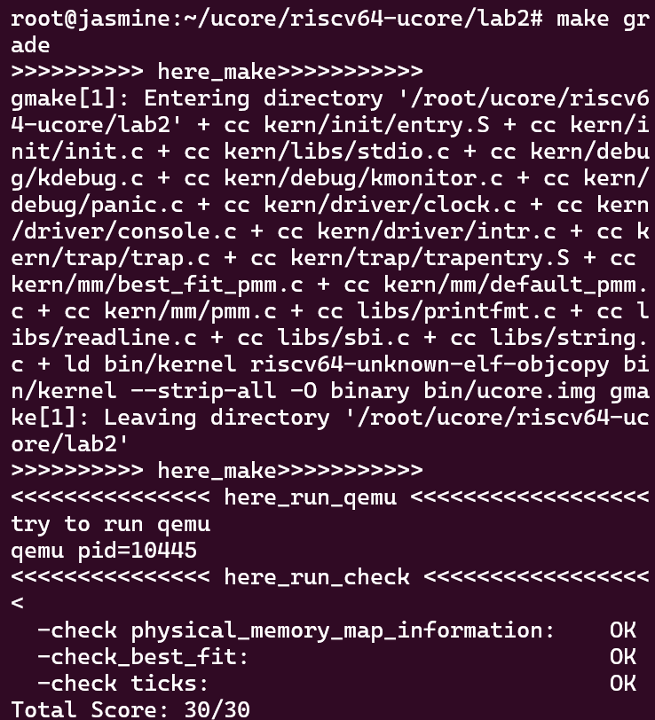

# lab2 实验报告

## 练习1：理解first-fit 连续物理内存分配算法

> 源码在(default_pmm.c)[./kern/mm/default_pmm.c]， 考虑报告篇幅， 除必要解释外不再插入整段代码

### default_init

函数用于初始化 free_list 并将 nr_free 设置为0。其中 free_list 用于记录空闲 mem 块。 nr_free 是空闲内存块中 page 的总数。

### default_init_memmap

调用图如：

该函数用于初始化一个空闲块（带参数： `addr_base` 、 `page_number` ）。初始化时需要以 Page 的粒度初始化这个空闲块， flags 应该被设置为 `PG_property` 位（意味着这个页面是有效的）。

- 如果该页是空闲的并且不是空闲块的第一页，则 p->property 应设置为 0。
- 如果此页是空闲的并且是空闲块的第一页，则 p->property 应设置为块的总数量。

p->ref 应该为 0，因为现在 p 是空闲的并且没有引用。使用 p->page_link 将此页面链接到 free_list。 最终对空闲内存块的数量求和：`nr_free+=n`。

### default_alloc_pages

函数用于 在空闲列表中搜索找到第一个空闲块（块大小 >=n）并调整空闲块大小，返回地址即分配的块。实现方法在 `while` 循环中，获取 `struct page` 并检查 `p->property`（记录空闲块的数量） >=n , 如果我们找到这个p，那么就意味着我们找到了一个空闲块（块大小>=n），并且前n页可以被分配。此时该页的一些标志位需要设置：PG_reserved =1, PG_property =0, 取消页面与 free_list 的链接， 且如果 `p->property >n`，我们应该重新计算这个空闲块的剩余部分的数量; 如果找不到空闲块（块大小 >=n），则返回 NULL。

### default_free_pages

将页面重新链接到空闲列表中，可能将小空闲块合并为大空闲块。根据撤回块的基址，查找空闲链表，找到正确的位置, 因为它插入 `free_list` 是按照地址顺序排序的， 这样就只需要查看头尾是否连续就可以确定是否需要合并。

### 改进空间

我认为改进的空间有：
  * 分配内存的时候按照页数来分，排序的时候按照地址来排序，导致每一次分配需要遍历链表，这样的缺点很明显：
    1. 时间复杂度高
    2. 容易造成外部碎片
  * 再有它 nr_free 这个操作记录的是整条链表上剩余的 page 数目， 但是在分配时显然都是针对于整块， 就需要连续内存， 这样可能需要块的移动， 但内存的移动消耗是很大的， 朴素地从 `如何减少移动` 思考， 其实或许是 `如何尽量高效地分配相邻空间` 的问题。

## 练习2：实现 Best-Fit 连续物理内存分配算法

`best-fit` 实现思路很简单， 代码与 `default_pmm` 相差也不大， 一点点区别在于 `best-fit` 找到一个可以用的块后不立即进行分割， 而是找到一个所需要大小最接近的块后再进行分割。

测试结果：

### 改进空间

与默认的内存管理类似，best-fit 我认为对前面我提出的问题没有多大改进，稍微优秀一点可能是一些情况下外部碎片更小，但同样这也是扫描整个链表换来的， 所以我认为改进的空间有：
  * 分配内存的时候按照页数来分，排序的时候按照地址来排序，导致每一次分配需要遍历链表，这样的缺点很明显：
    1. 时间复杂度高
    2. 容易造成外部碎片
  * 更深入地从 `如何减少移动` 思考， 其实或许是 `如何尽量高效地分配相邻空间` 的问题。