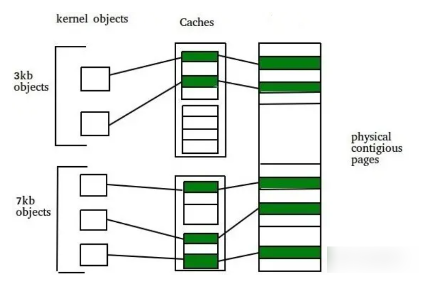

# slab 设计

## intro

目前实现了 `buddy_system`, 总结缺点有：

1. 分配不灵活。 当需要的字节数小于2的整数次幂时， 造成内部碎片的浪费
2. 反复合并分裂效率低， 当一个应用释放内存时可能短时间内它会再次申请内存， 如果仅使用 buddy system 进行管理， 则可能会在合并、分裂中反复。

所以， 一个更好的方案是使用 `slab` 分配器，实现两层架构的高效内存单元分配， 第一层是 **基于页大小的内存分配** ，第二层是 **在第一层基础上实现基于任意大小的内存分配**  。

在 `slab` 分配器中，**每一类** `objects` 拥有一个 `"cache"` （比如 `inode_cache, dentry_cache` ）。之所以叫做 "cache" ，是==因为每分配一个 object ，都从包含若干空闲的同类 objects 的区域获取，释放时也直接回到这个区域，这样可以缓存和复用相同的 objects ，加快分配和释放的速度==。

因此架构图如下




## design

## cache 设计

充分利用现有接口, 定义 cache 如下

```cpp
/// @brief 为每种范围大小的对象创建 cache
typedef struct mem_cache {
    unsigned int num;         // 对应 slab 总数量
    mem_slab_list_t fullslab; // slab 管理链表， 表示已满
    mem_slab_list_t usedslab; // slab 管理链表， 表示已用
    mem_slab_list_t freeslab; // slab 管理链表， 表示全空
} mem_cache_t;
```

## slab 设计

充分利用现有接口, 定义 slab 如下

```cpp
/// @brief slab 定义
typedef struct mem_slab {
    struct Page* allocate_pages; // 对应分配的地址
    unsigned int byte_free;      // 对应可用字节数
    unsigned int num;      // 对应 object 数量
    mem_object_t object_list;  
} mem_slab_t;
```