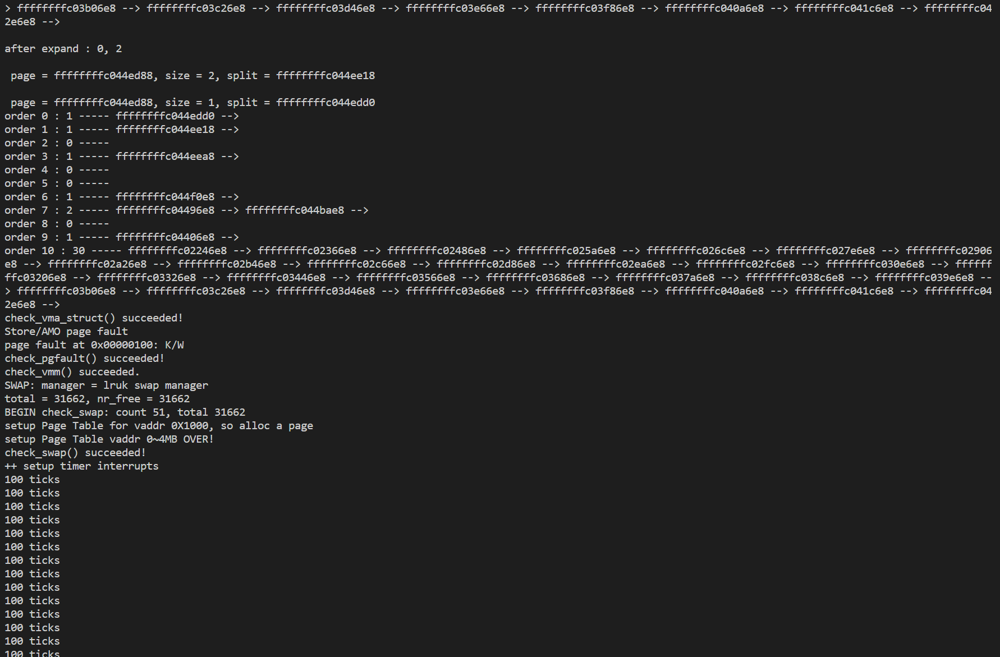

# LRU Design

> 这里其实想法是实现 `LRU-K`，即 lru 是一次访问则会让它被移出的可能性降低， lru-k 是 k 次访问则会让它被移出的可能性降低.

设计替换规则：

1. 如果在某段时间内访问 k 次以上， 则被低优先级换出
2. 在该段时间内不足 k 次访问， 则按照 fifo 换出
3. 在没有不足 k 次访问的数据页时，同样按照 fifo 换出

`k` 值以 `const`关键字修饰定义在 [swap_lruk.c](./kern/mm/swap_lruk.c) 文件中， 页的访问次数通过已有数据域 `Page.visited` 确定。

关于如何确定一个页被访问， 我想采用 KADDR 调用时触发 Page.visited 增加的方式。

将 Lab2 完成的 buddy system 和 lruk 一起使用， 使用 buddy system 里设计的函数 `__dump_list` 查看并验证。

## 初始化

```cpp
const int lru_k = 2;

list_entry_t pra_list_head;
list_entry_t lru_list_head;

static int
_lruk_init_mm(struct mm_struct *mm)
{     
     list_init(&pra_list_head);
     list_init(&lru_list_head);
     mm->sm_priv = &pra_list_head;
     //cprintf(" mm->sm_priv %x in lruk_init_mm\n",mm->sm_priv);
     return 0;
}
```
使用两个链表， 一个（`pra_list_head`）记录不足 k 次的 page, 一个（`lru_list_head`）记录记录超过 k 次访问的 page.

## 访问

```cpp
static int
_lruk_access_inc(struct mm_struct *mm, uintptr_t addr)
{
    pte_t* ptep = get_pte(mm->pgdir, addr, 0);
    if(ptep == NULL || *ptep == NULL)
    {
        return -1;
    }

    struct Page * target = pte2page(*ptep);
    list_entry_t * entry = &target->pra_page_link;

    // 大于等于 k 在 lru list
    if(target->visited >= lru_k)
    {
        list_del(entry);
        list_add(&lru_list_head, entry);
    }
    // 被 sm 管理
    else if(target->visited > 0)
    {
        list_del(entry);
        target->visited++;
        if(target->visited>=lru_k)
        {
            list_add(&lru_list_head, entry);
        }
        else{
            list_add(&pra_list_head, entry);
        }
    }
    return 0;
}
```

当页被访问时对管理链表进行更新。

## 换出

```cpp
static int
_lruk_swap_out_victim(struct mm_struct *mm, struct Page ** ptr_page, int in_tick)
{
     list_entry_t *head=(list_entry_t*) mm->sm_priv;
         assert(head != NULL);
     assert(in_tick==0);
    list_entry_t* entry = list_prev(head);
    if (entry != head) {
        list_del(entry);
        *ptr_page = le2page(entry, pra_page_link);
    } else {
        head = &lru_list_head;
        entry = list_prev(head);
        if (entry != head) {
            list_del(entry);
            *ptr_page = le2page(entry, pra_page_link);
        }
        else
        {
            ptr_page = NULL;
        }
    }
    cprintf("lru_ptr %lx\n", entry);
    return 0;
}
```

替换规则：

1. 如果在某段时间内访问 k 次以上， 则被低优先级换出
2. 在该段时间内不足 k 次访问， 则按照 fifo 换出
3. 在没有不足 k 次访问的数据页时，同样按照 fifo 换出

## 测试

将 Lab2 完成的 buddy system 和 lruk 一起使用， 使用 buddy system 里设计的函数 `__dump_list` 查看并验证。



头文件 [swap_lruk.h](./kern/mm/swap_lruk.h)
源文件 [swap_lruk.h](./kern/mm/swap_lruk.c)