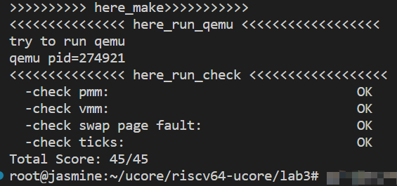

# lab3 report

## exercise 1 ：理解基于 FIFO 的页面替换算法（思考题）

1. **int do_pgfault (struct mm_struct \*mm, uint_t error_code, uintptr_t addr)**
  
   - **调用** ： 页面换入时，产生缺页异常会在调用 `do_pgfault` 函数

      ```mermaid
          graph LR
          A[exception_handler]-->B[pgfault_handler]
          B-->C[do_pgfault]
      ```

   - **功能** ：`do_pgfault` 在发生缺页异常时，检测当前页表中是否有包含该地址的页表项，若无则分配，并根据页表项将磁盘中的数据加载到物理页内并建立映射关系。

2. **struct vma_struct \* find_vma(struct mm_struct \*mm, uintptr_t addr)**
   - **调用** ： 在 `do_pgfault`  中根据 addr 寻找包含该地址的 vma.

      ```mermaid
          graph LR
          A[do_pgfault] --> B[find_vma]
      ```

   - **功能** ：根据 `addr`， 依照 `vma->vm_start <= addr && vma->vm_end > addr` 的关系， 遍历查找满足该条件的虚拟存储区域。

3. **pte_t \*get_pte(pde_t \*pgdir, uintptr_t la, bool create)**
   - **调用** ： 在 `do_pgfault`  中根据 addr 寻找包含该地址的 pte

      ```mermaid
          graph LR
          A[do_pgfault] --> B[get_pte]
      ```

   - **功能** ： 在 do_pgfault 中确定地址合法后，基于 PDT 查找 pte, 若没有找到，在第三个参数为 1 时创建一个 pte.

4. **int swap_in(struct mm_struct \*mm, uintptr_t addr, struct Page \*\*ptr_result)**
   - **调用** ： 在 `do_pgfault`  中根据 addr 将磁盘中对应的页换入到内存中

      ```mermaid
          graph LR
          A[do_pgfault] --> B[swap_in]
      ```

   - **功能** ： 利用 `alloc_page` 从系统内存管理系统中获得一个页后， 将 “磁盘” 中的页换入到分配的这个页中。

5. **int page_insert(pde_t \*pgdir, struct Page \*page, uintptr_t la, uint32_t perm)**
   - **调用** ： 在 `do_pgfault`  中根据 addr 将 swap_in 获得的页放入对应的 pte 中

      ```mermaid
          graph LR
          A[do_pgfault] --> B[page_insert]
      ```

   - **功能** ： 根据 addr 将 页放入对应的 pte 中，更新 tlb

6. **int swap_map_swappable(struct mm_struct \*mm, uintptr_t addr, struct Page \*page, int swap_in)**
   - **调用** ： 在 `do_pgfault`  调用记录页的使用/换入

      ```mermaid
          graph LR
          A[do_pgfault] --> B[swap_map_swappable]
      ```

   - **功能** ： 记录页的使用/换入
   - `_fifo_map_swappable` 函数
     - 将最近被用到的页面添加到算法所维护的次序队列
     - 建立一个指针指向最近使用的页面，然后在列表中新建一个空指针，将最近用到的页面添加到次序队尾

   - `_fifo_swap_out_victim` 函数
     - 查询哪个页面需要被换出,并执行换出操作
     - 使用链表操作，删除掉最早进入的那个页，并按照注释将这个页面给到传入参数 ptr_page

换出页面到磁盘

- pmm.c/alloc_pages() : 分配空闲页的函数，在该函数中如果没有空闲的页时调用swap_out();换出一个页面到磁盘。
- swap.c/swap_out() : 该函数完成具体的物理页面换出到磁盘的过程
- swap_out()->swap_fifo.c/swap_out_victim(mm, &page, in_tick) : 调用FIFO算法将最早换入的页面从链表中卸下并存入page指针里
- pmm.c/get_pte() : 取到要换出的page后，调用该函数根据其虚拟地址分配一个对应的页表项的地址
- kern/fs/swapfs.c/swapfs_write : 将要换出的物理页面写入硬盘上并根据返回值判断是否写入失败
- sm->map_swappable(mm, v, page, 0) : 如果写入磁盘失败，将刚刚取出的物理页重新链入到原来位置
- free_page(page) : 如果写入磁盘成功，从内存中释放刚刚换出的页面
- pmm.c/tlb_invalidate : 由于页表改变，调用此函数执行flush_tlb()刷新TLB

## exercise 2：深入理解不同分页模式的工作原理（思考题）

get_pte() 函数（位于 kern/mm/pmm.c ）用于在页表中查找或创建页表项，从而实现对指定线性地址对应的物理页的访问和映射操作。这在操作系统中的分页机制下，是实现虚拟内存与物理内存之间映射关系非常重要的内容。

- get_pte()函数中有两段形式类似的代码， 结合sv32，sv39，sv48的异同，解释这两段代码为什么如此相像。
- 目前get_pte()函数将页表项的查找和页表项的分配合并在一个函数里，你认为这种写法好吗？有没有必要把两个功能拆开？

两段相似代码

- 第一段代码的作用是创建一级页表项（ `pdep1` ），并将其设置为有效和用户可访问。如果一级页表项已经存在映射关系，则直接返回该页表项的指针。如果一级页表项不存在映射关系，则分配一个物理页面，并将该页面的物理地址清零，然后创建一个新的页表项，并将其写入页表中。
- 第二段代码的作用是创建二级页表项（ `pdep0` ），并将其设置为有效和用户可访问。如果二级页表项已经存在映射关系，则直接返回该页表项的指针。如果二级页表项不存在映射关系，则分配一个物理页面，并将该页面的物理地址清零，然后创建一个新的页表项，并将其写入页表中。
- 这两段代码之所以相似，是因为它们都是用于创建页表项的，并且都包含了相同的逻辑：检查页表项是否已经存在映射关系，如果不存在则分配物理页面并创建新的页表项。
- sv32 使用 32 位虚拟地址，sv39使用 39 位虚拟地址，sv48使用 48 位虚拟地址。这些不同的页表格式在页表项的结构和位域设置上有所不同，但是页表项的创建逻辑是相似的。因此，无论使用哪种页表格式，创建页表项的代码都会有相似的结构和逻辑。

要说缺点， 我觉得要考虑实现的是什么系统。比如考虑多核等，拆分后加不同的锁可以有更好的性能。

## exercise 3：给未被映射的地址映射上物理页（需要编程）

补充完成do_pgfault（mm/vmm.c）函数，给未被映射的地址映射上物理页。设置访问权限 的时候需要参考页面所在 VMA 的权限，同时需要注意映射物理页时需要操作内存控制 结构所指定的页表，而不是内核的页表。
请在实验报告中简要说明你的设计实现过程。请回答如下问题：

- 请描述页目录项（Page Directory Entry）和页表项（Page Table Entry）中组成部分对ucore实现页替换算法的潜在用处。
- 如果ucore的缺页服务例程在执行过程中访问内存，出现了页访问异常，请问硬件要做哪些事情？
- 数据结构Page的全局变量（其实是一个数组）的每一项与页表中的页目录项和页表项有无对应关系？如果有，其对应关系是啥？

1. 页目录表和 mm_struct 结构对应，用于根据传入的线性地址索引对应的页表；页表项，即一个 PTE 用来描述一般意义上的物理页时，应该有 `PTE_P` 标记，即表示物理页存在；但当它用来描述一个被置换出去的物理页时，它被用来==维护该物理页与 swap 磁盘上扇区的映射关系==，此时没有 PTE_P 标记。页替换涉及到换入换出，换入时需要将某个虚拟地址对应于磁盘的一页内容读入到内存中，换出时需要将某个虚拟页的内容写到磁盘中的某个位置，因此页表项可以记录该虚拟页在磁盘中的位置，也为换入换出提供磁盘位置信息.

   分页机制的实现确保了虚拟地址和物理地址之间的对应关系。一方面，通过查找虚拟地址是否存在于一二级页表中可知发现该地址是否是合法的；同时可以通过修改映射关系实现页替换操作。另一方面，在实现页替换时涉及到换入换出：换入时需要将某个虚拟地址对应的磁盘的一页内容读入到内存中，换出时需要将某个虚拟页的内容写到磁盘中的某个位置。而页表项可以记录该虚拟页在磁盘中的位置，为换入换出提供磁盘位置信息，页目录项则是用来索引对应的页表。同时，我们可知PDE和PTE均保留了一些位给操作系统使用，具体可以应用在页替换算法时。present位为0时CPU不使用PTE上内容，这时候这些位便会闲置，可以将闲置位用于保存别的信息，例如页替换算法被换出的物理页在交换分区的位置等。同时，需要注意到dirty位，操作系统根据脏位可以判断是否对页数据进行write through。

   页目录项：

      P (Present) 位：表示该页保存在物理内存中。
      R (Read/Write) 位：表示该页可读可写。
      U (User) 位：表示该页可以被任何权限用户访问。
      W (Write Through) 位：表示 CPU 可以直写回内存。
      D (Cache Disable) 位：表示不需要被 CPU 缓存。
      A (Access) 位：表示该页被写过。
      S (Size) 位：表示一个页 4MB 。
      9-11 位保留给 OS 使用。
      12-31 位指明 PTE 基质地址。

   页表项：

      0-3 位同 PDE。
      C (Cache Disable) 位：同 PDE D 位。
      A (Access) 位：同 PDE 。
      D (Dirty) 位：表示该页被写过。
      G (Global) 位：表示在 CR3 寄存器更新时无需刷新 TLB 中关于该页的地址。
      9-11 位保留给 OS 使用。
      12-31 位指明物理页基址。

      ```C
      struct Page {
         int ref;                        // page frame's reference counter
         uint_t flags;                 // array of flags that describe the status of the page frame
         uint_t visited;
         unsigned int property;          // the num of free block, used in first fit pm manager
         list_entry_t page_link;         // free list link
         list_entry_t pra_page_link;     // used for pra (page replace algorithm)
         uintptr_t pra_vaddr;            // used for pra (page replace algorithm)
      };
      ```

2. CPU 会把产生异常的线性地址存储在 `CR2` 寄存器中，并且把表示页访问异常类型的 `error Code` 保存在中断栈中，以便恢复现场。然后就是和普通的中断一样，保护现场，将寄存器的值压入栈中，设置错误代码 error_code，触发 Page Fault 异常，然后压入 error_code 中断服务例程，将外存的数据换到内存中来，最后退出中断，回到进入中断前的状态。

3. 数据结构 page 是最低级的页表，目录项是一级页表，存储的内容是页表项的起始地址（二级页表），而页表项是二级页表，存储的是每个页表的开始地址，这些内容之间的关系时通过线性地址高低位不同功能的寻址体现的

## exercise 4：补充完成Clock页替换算法（需要编程）

通过之前的练习，相信大家对FIFO的页面替换算法有了更深入的了解，现在请在我们给出的框架上，填写代码，实现 Clock页替换算法（mm/swap_clock.c）。
请在实验报告中简要说明你的设计实现过程。请回答如下问题：

`Clock` 页替换算法和 `FIFO` （先进先出）算法的差异主要在：

1. FIFO 算法的目标是淘汰最先进入的页面，而 Clock 算法的目标是淘汰下一个遇到的使用位为0的页面。
2. FIFO 算法是线性扫描，从内存的开始位置依次扫描，淘汰最先进入的页面。而 Clock 算法是循环扫描，指针从开始位置依次移动，当遇到使用位为 0 的页面时，就淘汰该页面。
3. 在 Clock 算法中，有一个附加位，在首次装入内存或是被访问之后，附加位变为 1。当指针移动到某个页面时，如果该页面的附加位为 0 ，就继续移动指针，直到找到附加位为1的页面为止。然后替换该页面，并将新替换的页面的附加位设为 1。

实现过程，其实一开始想实现进阶的 clock， 但是发现 `make grade` 会不成功， 就保留原版好了。

## exercise 5：阅读代码和实现手册，理解页表映射方式相关知识（思考题）

如果我们采用”一个大页“ 的页表映射方式，相比分级页表，有什么好处、优势，有什么坏处、风险？

- 好处
  - 实现简单，仅需要维护一个页表
  - 访问速度快，直接访问页表即可，中间无需其他查找操作，所以速度较快
  - 内存占用少，仅需要一个页表即可支持页表映射，所需内存少
- 坏处
  - 页表大小受限制，大虚拟内存空间不适用。由于每个虚拟内存页对应一个页表项，当虚拟内存非常大，页表需要的物理内存随之增加，系统会进行限制
  - 访问效率（另一个角度会较低）。页表是以线性结构存储页表项，虚拟空间很大时，页表项数量随之增大，查找速度慢，查找对应的物理页框也就慢了。
  - TLB 缓存频繁缺失。TLB缓存有限，虚拟空间很大，导致一级页表较大，导致TLB无法缓存最近使用的所有页表项，导致命中概率降低，查询转换速率降低。



## 扩展练习 Challenge：LRU页替换算法（需要编程）

设计文件 [design-lru](./design-lru.md)
头文件 [swap_lruk.h](./kern/mm/swap_lruk.h)
源文件 [swap_lruk.h](./kern/mm/swap_lruk.c)
