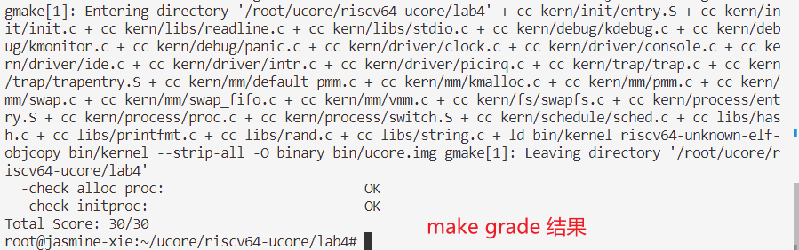

# lab4 report

> author: Jasmine Xie 2113302

---

## exercise 1 : 分配并初始化一个进程控制块

说明 `struct proc_struct *proc` 各变量意义为：

- state：进程状态，proc.h 中定义了四种状态：UNINIT创建进程、SLEEPING休眠进程、RUNNABLE运行进程、ZOMBIE僵尸进程
- pid：进程ID
- runs：线程运行总数
- need_resched：标志位，表示该进程是否需要重新参与调度以释放CPU
- parent：父进程控制块指针
- mm：用户进程虚拟内存管理单元指针， 这里系统进程没有虚存
- context：进程上下文
- tf：中断帧指针
- cr3：该进程页目录表的基址寄存器，初值为ucore启动时建立好的内核虚拟空间的页目录表首地址boot_cr3， 在kern/mm/pmm.c的pmm_init函数中初始化
- flags：进程标志位
- name：进程名数组

故在 `alloc_proc` 中完成初始化如下：

```cpp
        proc->state = PROC_UNINIT;
        proc->pid = -1;
        proc->runs = 0;
        proc->kstack = 0;
        proc->need_resched = 0;
        proc->parent = NULL;
        proc->mm = NULL;
        memset(&(proc->context), 0, sizeof(struct context));
        proc->tf = NULL;
        proc->cr3 = boot_cr3;
        proc->flags = 0;
        memset(proc->name, 0, PROC_NAME_LEN);
```

> **Question**: 请说明proc_struct中 struct context context 和 struct trapframe *tf 成员变量含义 和在 本实验中的作用是啥？

1. context 指 进程上下文，这部分空间用于保存创建进程时父进程的部分寄存器值, 主要保存 caller registers 的值, 因为 callee registers 的值会在发生函数调用时由编译器自动生成汇编代码保存到栈上。本次实验中的作用和其本意无差，就是保存父进程上下文的作用。

2. tf 是中断帧的指针，当进程从用户空间跳到内核空间时，中断帧记录了进程在被中断前的状态。 当内核需要跳回用户空间时，需要调整中断帧以恢复让进程继续执行的各寄存器值。本次实验中的作用考虑只有内核进程， tf 没有真正用到。

## exercise 2 : 为新创建的内核线程分配资源

`do_fork` 的作用是，创建当前内核线程的一个副本，它们的执行上下文、代码、数据都一样，但是存储位置不同。因此，我们实际需要 "fork" 的东西就是stack 和 trapframe。

- 调用 `alloc_proc` ，首先获得一块用户信息块。
- 为进程分配一个内核栈。
- 复制原进程的内存管理信息到新进程 （但内核线程不必做此事）
- 复制原进程上下文到新进程
- 将新进程添加到进程列表
- 唤醒新进程
- 返回新进程号

对应代码段：

```cpp

    proc = alloc_proc();
    if(proc == NULL) goto fork_out;
    // 设置新创建进程的父进程
    proc->parent = current;
    if(setup_kstack(proc) == -E_NO_MEM) {
        goto bad_fork_cleanup_proc;
    }
    if(copy_mm(clone_flags,proc)!= 0)
    {
        goto bad_fork_cleanup_kstack;
    }
    copy_thread(proc, stack, tf);
    
    proc->pid=get_pid();
    hash_proc(proc);
    list_add_after(&proc_list,&(proc->list_link));
    nr_process++;
    

    wakeup_proc(proc);
    return proc->pid;

fork_out:
    return ret;

bad_fork_cleanup_kstack:
    put_kstack(proc);
bad_fork_cleanup_proc:
    kfree(proc);
    goto fork_out;
```

> **Question**: 请说明ucore是否做到给每个新 fork 的线程一个唯一的id?

分配 id 对应代码：

```cpp
static int
get_pid(void)
{
    static_assert(MAX_PID > MAX_PROCESS);
    struct proc_struct *proc;
    list_entry_t *list = &proc_list, *le;
    static int next_safe = MAX_PID, last_pid = MAX_PID;
    if (++last_pid >= MAX_PID)
    {
        last_pid = 1;
        goto inside;
    }
    if (last_pid >= next_safe)
    {
    inside:
        next_safe = MAX_PID;
    repeat:
        le = list;
        while ((le = list_next(le)) != list)
        {
            proc = le2proc(le, list_link);
            if (proc->pid == last_pid)
            {
                if (++last_pid >= next_safe)
                {
                    if (last_pid >= MAX_PID)
                    {
                        last_pid = 1;
                    }
                    next_safe = MAX_PID;
                    goto repeat;
                }
            }
            else if (proc->pid > last_pid && next_safe > proc->pid)
            {
                next_safe = proc->pid;
            }
        }
    }
    return last_pid;
}
```

易看出代码逻辑为：

1. last_pid 小于等于 MAX_PID
2. 与线程链表对比，保证 pid 未被分配过

利用静态变量的语言特性来更新 pid 的范围。分析认为 pid 分配与线程唯一对应。

## exercise 3： 编写proc_run 函数

proc_run 用于将指定的进程切换到 CPU 上运行。它的大致执行步骤包括：

1. 检查要切换的进程是否与当前正在运行的进程相同，如果相同则不需要切换。
2. 禁用中断。
3. 切换当前进程为要运行的进程。
4. 切换页表，以便使用新进程的地址空间。/libs/riscv.h中提供了lcr3(unsigned int cr3)函数，可实现修改CR3寄存器值的功能。
5. 实现上下文切换。/kern/process中已经预先编写好了switch.S，其中定义了switch_to()函数。可实现两个进程的context切换。
6. 允许中断。

对应代码为：

```cpp
        bool flag;
        local_intr_save(flag);

        struct proc_struct * prev = current;
        current = proc;

        lcr3(proc->cr3);
        switch_to(&(prev->context),&(current->context));
        
        local_intr_restore(flag);
```

> **Question**:  在本实验的执行过程中，创建且运行了几个内核线程？

两个。分别是：

1. idleproc: 在系统没有其他任务需要执行时，占用 CPU 时间，同时便于进程调度的统一化。
2. initproc: 在lab4中，这个子内核线程的工作就是输出一些字符串，然后就返回了（参看 init_main 函数）。而在后续的实验中，init_main 的工作就是创建特定的其他内核线程或用户进程。


> 

## challenge

> **Question**:  语句 local_intr_save(intr_flag); …local_intr_restore(intr_flag); 如何实现开关中断

`Answer` : 通过修改 `RISC-V` 标准的 CSR 寄存器，对 `sstatus` 的特定 bit 置位/清零实现。
