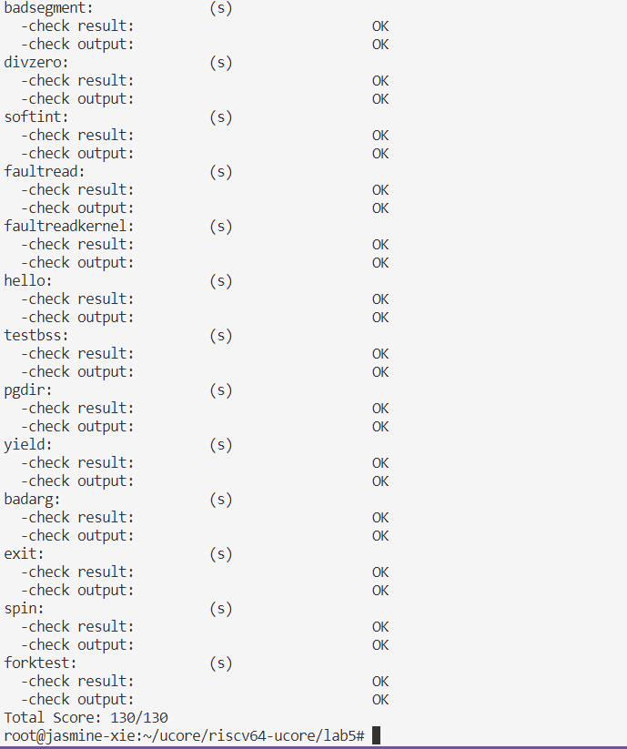

# lab5 report

## exercise 0:

> 本实验依赖实验2/3/4。请把你做的实验2/3/4的代码填入本实验中代码中有“LAB2”/“LAB3”/“LAB4”的注释相应部分。注意：为了能够正确执行lab5的测试应用程序，可能需对已完成的实验2/3/4的代码进行进一步改进。

对于本实验和 lab4 实验的不同，首先查看线程的定义增加了两个成员变量：

```cpp
    uint32_t wait_state;                        // waiting state
    struct proc_struct *cptr, *yptr, *optr;     // relations between processes
```

其中：
- wait_state： 表示并发执行在 sleeping 状态的线程等待，其他状态为 0
- 三个指针代表了线程之间的相对关系。

### process relation

- remove_links
- set_links

process relations
- parent:           proc->parent  (proc is children)
- children:         proc->cptr    (proc is parent)
- older sibling:    proc->optr    (proc is younger sibling)
- younger sibling:  proc->yptr    (proc is older sibling)


### 初始化线程时

对应在初始化分配线程空间时修改：
```cpp
        proc->wait_state = 0;
        proc->cptr = proc->yptr = proc->optr = NULL;
```

从初始化开始，梳理一下到第一个用户线程创建的全过程。

1. `kern_entry`:
    - 设置 boot_page_table_sv39， 设置 satp 各字段
    - 转换为虚拟地址， 跳转到 kern_init
2. `kern_init`:
    - `pmm_init`: 初始化、检查物理内存分配
    - `pic_init`: 初始化中断控制器，看源代码什么都没有
    - `idt_init`: 初始化中断相关寄存器（sscratch，stvec，sstatus）
    - `vmm_init`: 检查虚拟内存管理
    - `proc_init`: 初始化 idle 空闲进程, 基于空闲进程 fork 一个初始的内核线程
        ```cpp
        // kernel_thread(init_main, NULL, 0);
        tf.status = (read_csr(sstatus) | SSTATUS_SPP | SSTATUS_SPIE) & ~SSTATUS_SIE;
        tf.epc = (uintptr_t)kernel_thread_entry;
        ```
        init_main 中：
        - `kernel_thread(user_main, NULL, 0);` 用户线程执行 KERNEL_EXECVE，第一个用户线程的 status 寄存器状态与 initproc 相同。
        - `do_wait(0,NULL)` ： 等待子进程释放并释放子进程
    - `ide_init`: 初始化设备
    - `swap_init`: 初始化页面置换
    - `clock_init`: 初始化时钟中断
    - `cpu_idle`: 运行空闲进程，开始进程调度

在 do_fork 函数中修改

```cpp
   //LAB4:EXERCISE2 2113302
    /*
     * Some Useful MACROs, Functions and DEFINEs, you can use them in below implementation.
     * MACROs or Functions:
     *   alloc_proc:   create a proc struct and init fields (lab4:exercise1)
     *   setup_kstack: alloc pages with size KSTACKPAGE as process kernel stack
     *   copy_mm:      process "proc" duplicate OR share process "current"'s mm according clone_flags
     *                 if clone_flags & CLONE_VM, then "share" ; else "duplicate"
     *   copy_thread:  setup the trapframe on the  process's kernel stack top and
     *                 setup the kernel entry point and stack of process
     *   hash_proc:    add proc into proc hash_list
     *   get_pid:      alloc a unique pid for process
     *   wakeup_proc:  set proc->state = PROC_RUNNABLE
     * VARIABLES:
     *   proc_list:    the process set's list
     *   nr_process:   the number of process set
     */

    //    1. call alloc_proc to allocate a proc_struct
    //    2. call setup_kstack to allocate a kernel stack for child process
    //    3. call copy_mm to dup OR share mm according clone_flag
    //    4. call copy_thread to setup tf & context in proc_struct
    //    5. insert proc_struct into hash_list && proc_list
    //    6. call wakeup_proc to make the new child process RUNNABLE
    //    7. set ret vaule using child proc's pid

    //LAB5 2113302 : (update LAB4 steps)
    //TIPS: you should modify your written code in lab4(step1 and step5), not add more code.
   /* Some Functions
    *    set_links:  set the relation links of process.  ALSO SEE: remove_links:  lean the relation links of process 
    *    -------------------
    *    update step 1: set child proc's parent to current process, make sure current process's wait_state is 0
    *    update step 5: insert proc_struct into hash_list && proc_list, set the relation links of process
    */
    proc = alloc_proc();
    if(proc == NULL) goto fork_out;
    // 设置新创建进程的父进程
    proc->parent = current;
    current->wait_state = 0;
    if(setup_kstack(proc) == -E_NO_MEM) {
        goto bad_fork_cleanup_proc;
    }
    if(copy_mm(clone_flags,proc)!= 0)
    {
        goto bad_fork_cleanup_kstack;
    }
    copy_thread(proc, stack, tf);
    
    proc->pid=get_pid();
    hash_proc(proc);
    set_links(proc); // 设置进程间关系

    wakeup_proc(proc);
    return proc->pid;
```

## exercise 1: 

> do_execv函数调用load_icode（位于kern/process/proc.c中）来加载并解析一个处于内存中的ELF执行文件格式的应用程序。你需要补充load_icode的第6步，建立相应的用户内存空间来放置应用程序的代码段、数据段等，且要设置好proc_struct结构中的成员变量trapframe中的内容，确保在执行此进程后，能够从应用程序设定的起始执行地址开始执行。需设置正确的trapframe内容。
>
> 请在实验报告中简要说明你的设计实现过程。
>
> 请简要描述这个用户态进程被ucore选择占用CPU执行（RUNNING态）到具体执行应用程序第一条指令的整个经过。

### load_icode

函数的主要工作就是给用户进程建立一个能够让用户进程正常运行的用户环境。完成了如下重要工作：

1. 调用mm_create函数来申请进程的内存管理数据结构mm所需内存空间，并对mm进行初始化；

2. 调用setup_pgdir来申请一个页目录表所需的一个页大小的内存空间，并把==描述ucore内核虚空间映射的内核页表（boot_pgdir所指）的内容拷贝到此新目录表中==，最后让mm->pgdir指向此页目录表，这就是进程新的页目录表了，且能够正确映射内核虚空间；

3. 根据应用程序执行码的起始位置来解析此ELF格式的执行程序，并调用mm_map函数根据ELF格式的执行程序说明的各个段（代码段、数据段、BSS段等）的起始位置和大小建立对应的vma结构，并把vma插入到mm结构中，从而表明了用户进程的合法用户态虚拟地址空间；

4. 调用根据执行程序各个段的大小分配物理内存空间，并根据执行程序各个段的起始位置确定虚拟地址，并在页表中建立好物理地址和虚拟地址的映射关系，然后把执行程序各个段的内容拷贝到相应的内核虚拟地址中，至此应用程序执行码和数据已经根据编译时设定地址放置到虚拟内存中了；

5. 需要给用户进程设置用户栈，为此调用mm_mmap函数建立用户栈的vma结构，明确用户栈的位置在用户虚空间的顶端，大小为256个页，即1MB，并分配一定数量的物理内存且建立好栈的虚地址<-->物理地址映射关系；

6. 至此,进程内的内存管理vma和mm数据结构已经建立完成，于是把mm->pgdir赋值到cr3寄存器中，即更新了用户进程的虚拟内存空间，此时的initproc已经被应用程序的代码和数据覆盖，成为了第一个用户进程，但此时这个用户进程的执行现场还没建立好；

7. 先清空进程的中断帧，再重新设置进程的中断帧，**使得在执行中断返回指令“iret”后，能够让CPU转到用户态特权级**，==并回到用户态内存空间，使用用户态的代码段、数据段和堆栈，且能够跳转到用户进程的第一条指令执行，并确保在用户态能够响应中断==；

> 注意我们需要让CPU进入U mode执行do_execve()加载的用户程序。进行系统调用 sys_exec 之后，我们在trap返回的时候调用了sret指令，这时只要sstatus寄存器的SPP二进制位为0，就会切换到U mode，但SPP存储的是“进入trap之前来自什么特权级”，也就是说我们这里ebreak之后SPP的数值为1，sret之后会回到S mode在内核态执行用户程序。所以load_icode()函数在构造新进程的时候，会把SSTATUS_SPP设置为0，使得sret的时候能回到U mode

### 代码完善

- tf->gpr.sp 设置为用户栈顶，也即宏定义 USTACKTOP
- tf->epc 设置为二进制可执行文件入口，根据 ELP 文件定义设置 elf->e_entry;
- tf->status 设置 sstatus & ~(SSTATUS_SPP | SSTATUS_SPIE) | SSTATUS_UIE;
    - SSTATUS_SPP 保存进入异常之前，处理器处于模式
    - SSTATUS_SPIE 保存进入异常之前，处理器中断开启状态
    - SSTATUS_UIE 开启用户态中断响应

```cpp
    /* LAB5:EXERCISE1 2113302
     * should set tf->gpr.sp, tf->epc, tf->status
     * NOTICE: If we set trapframe correctly, then the user level process can return to USER MODE from kernel. So
     *          tf->gpr.sp should be user stack top (the value of sp)
     *          tf->epc should be entry point of user program (the value of sepc)
     *          tf->status should be appropriate for user program (the value of sstatus)
     *          hint: check meaning of SPP, SPIE in SSTATUS, use them by SSTATUS_SPP, SSTATUS_SPIE(defined in risv.h)
     */
    tf->gpr.sp = USTACKTOP;
    tf->epc = elf->e_entry;
    tf->status = sstatus & ~(SSTATUS_SPP | SSTATUS_SPIE) | SSTATUS_UIE;
    
    ret = 0;
```

### 执行流程

- 在 init_main 中调用 `kernel_thread(user_main, NULL, 0);` 初始化第一个用户线程；
    - `kernel_thread` 调用统一的 `do_fork` 完成正常的基于当前线程的克隆；
    - `user_main` 使用C语言宏定义的一些小技巧完成字符串的拼接，确定要读取的二进制文件。
- `user_main` 中调用 `kernel_execve` , 在前序完成对线程的初始化后，kernel_execve 内嵌汇编代码，通过宏定义的 syscall 类型对应在：

```cpp
static int (*syscalls[])(uint64_t arg[]) = {
    [SYS_exit]              sys_exit,
    [SYS_fork]              sys_fork,
    [SYS_wait]              sys_wait,
    [SYS_exec]              sys_exec,
    [SYS_yield]             sys_yield,
    [SYS_kill]              sys_kill,
    [SYS_getpid]            sys_getpid,
    [SYS_putc]              sys_putc,
    [SYS_pgdir]             sys_pgdir,
};
```

完成内核权限的转换，并调用到 sys_exec:

```cpp
static int
sys_exec(uint64_t arg[]) {
    const char *name = (const char *)arg[0];
    size_t len = (size_t)arg[1];
    unsigned char *binary = (unsigned char *)arg[2];
    size_t size = (size_t)arg[3];
    return do_execve(name, len, binary, size);
}
```

函数 `do_execve` 的细节作用在报告[do_execve](#do_execve) 部分。使用 do_execve 完成加载应用程序执行码到当前进程的新创建的用户态虚拟空间中后返回，结束 syscall 后返回用户态执行代码。

## Exercise 2

### ex2 代码完善

这一部分逻辑挺简单的，将页面内容复制到 npage，构建 phy addr 的映射，根据提示完成代码：

```cpp
// kern/mm/pmm.c：copy_range
             uintptr_t src_kvaddr = page2kva(page);
             uintptr_t dst_kvaddr = page2kva(npage);
             memcpy(dst_kvaddr,src_kvaddr, PGSIZE);
             ret = page_insert(to, npage, start, perm);
```

### cow 思路

- call graph: copy_mm-->dup_mmap-->copy_range
    - copy_mm: 根据传入参数确定是共享内存还是复制内存
    - dup_mmap： 复制内存，创建一个 vma, 调用 copy_range 将 vma 内容复制
    - copy_range： 确定 vma 范围以及权限，将 vma start~end 的内容完成深拷贝
- 要实现 cow 即在 copy_range 中不分配内存（不调用 `alloc_page`）, 而仅是指向同一区域，使用 `share` 成员变量，记录当前内存为共享，当某一线程的页表为共享且尝试修改时，则再调用 `alloc_page` 进行分配，并标注新分配的空间为独占。

## Exercise 3

理解进程执行 fork/exec/wait/exit 的实现

### 创建


从初始化开始，到第一个用户线程创建：

1. `kern_entry`:
    - 设置 boot_page_table_sv39， 设置 satp 各字段
    - 转换为虚拟地址， 跳转到 kern_init
2. `kern_init`:
    - `pmm_init`: 初始化、检查物理内存分配
    - `pic_init`: 初始化中断控制器，看源代码什么都没有
    - `idt_init`: 初始化中断相关寄存器（sscratch，stvec，sstatus）
    - `vmm_init`: 检查虚拟内存管理
    - `proc_init`: 初始化 idle 空闲进程, 基于空闲进程 fork 一个初始的内核线程
        ```cpp
        // kernel_thread(init_main, NULL, 0);
        tf.status = (read_csr(sstatus) | SSTATUS_SPP | SSTATUS_SPIE) & ~SSTATUS_SIE;
        tf.epc = (uintptr_t)kernel_thread_entry;
        ```
        init_main 中：
        - `kernel_thread(user_main, NULL, 0);` 用户线程执行 KERNEL_EXECVE，第一个用户线程的 status 寄存器状态与 initproc 相同。
        - `do_wait(0,NULL)` ： 等待子进程释放并释放子进程
    - `ide_init`: 初始化设备
    - `swap_init`: 初始化页面置换
    - `clock_init`: 初始化时钟中断
    - `cpu_idle`: 运行空闲进程，开始进程调度

### do_execve

函数来完成用户进程的创建工作。此函数的主要工作流程如下：

1. 调用 user_mem_check， 检查指向的内存空间能否被用户态程序访问。
```cpp
#define USER_ACCESS(start, end)                     \
(USERBASE <= (start) && (start) < (end) && (end) <= USERTOP)

#define KERN_ACCESS(start, end)                     \
(KERNBASE <= (start) && (start) < (end) && (end) <= KERNTOP)

```

2. 为加载新的执行码做好用户态内存空间清空准备。如果mm不为NULL，则设置页表为内核空间页表，且进一步判断mm的引用计数减1后是否为0，如果为0，则表明没有进程再需要此进程所占用的内存空间，为此将根据mm中的记录，释放进程所占用户空间内存和进程页表本身所占空间。最后把当前进程的mm内存管理指针为空。由于此处的initproc是内核线程，所以mm为NULL，整个处理都不会做。

3. 接下来的一步是加载应用程序执行码到当前进程的新创建的用户态虚拟空间中。这里涉及到读ELF格式的文件，申请内存空间，建立用户态虚存空间，加载应用程序执行码等。load_icode函数完成了整个复杂的工作。

### do_exit

函数用于处理进程的退出。`do_exit` 接受一个整数`error_code`作为参数，这个参数通常用于表示进程退出时的状态码。

对代码进行解释：

1. `if (current == idleproc) { panic("idleproc exit.\n"); }`：检查当前进程是否是`idleproc`，即系统空闲进程。如果是，则触发一个 panic，因为空闲进程不应该退出。
2. `if (current == initproc) { panic("initproc exit.\n"); }`：检查当前进程是否是`initproc`，即初始化进程。如果是，同样触发一个 panic，因为初始化进程也不应该退出。
3. `struct mm_struct *mm = current->mm;`：获取当前进程的内存管理结构体指针。
4. `if (mm != NULL) { ... }`：如果当前进程有内存管理结构（即它有分配的内存），如果mm不为空，说明是用户进程, 切换到内核页表，确保接下来的操作在内核空间执行, 减少mm引用计数， 如果mm引用计数减到0，说明没有其他进程共享此mm则进行一系列操作来释放和销毁该内存。使用 exit_mmap & put_pgdir & mm_destroy 来释放内存。
5. `current->mm = NULL;`：将当前进程的内存管理结构体指针设置为 NULL。
6. `current->state = PROC_ZOMBIE;`：将当前进程的状态设置为`PROC_ZOMBIE`，表示它已经结束但尚未被回收。
7. `current->exit_code = error_code;`：将当前进程的退出码设置为传入的`error_code`。
8-17. 这部分代码处理当前进程的子进程。如果子进程存在，那么就唤醒它们的父进程，并让父进程处理它们。

18. `bool intr_flag; local_intr_save(intr_flag); { ... } local_intr_restore(intr_flag);`：这是一个保存和恢复中断标志的代码块。它确保在处理子进程时不会被中断。

19-23. 这部分代码再次处理当前进程的子进程，确保它们被正确地回收和清理。

24. `schedule();`：调度其他进程运行。当一个进程退出时，内核会调度一个新的进程来运行。
25. `panic("do_exit will not return!! %d.\n", current->pid);`：这行代码不应该被执行，因为`schedule()`函数会立即调度其他进程，使得这个进程不会返回。如果看到这个 panic 消息，说明内核中存在严重的问题。

当一个进程结束时，它将被设置为`PROC_ZOMBIE`状态，**并由父进程来回收和清理其资源**。如果有其他进程在等待这个退出的进程释放的资源，那么它们将被唤醒并重新添加到调度队列中。


### do_wait

1. 首先进行检查
2. 若`pid`等于0，就去找对应的孩子进程，否则就任意的一个快死的孩子进程。如果此子进程的执行状态不为`PROC_ZOMBIE`，表明此子进程还没有退出，则当前进程只 好设置自己的执行状态为`PROC_SLEEPING`，睡眠原因为`WT_CHILD`（即等待子进程退 出），调用`schedule()`函数选择新的进程执行，自己睡眠等待，如果被唤醒，则重复该步骤执行；
3. 如果此子进程的执行状态为`PROC_ZOMBIE`，表明此子进程处于退出状态，需要当前进程 （即子进程的父进程）完成对子进程的最终回收工作，即首先把子进程控制块从两个进程队列`proc_list`和`hash_list`中删除，并释放子进程的内核堆栈和进程控制块。自此，子进程才彻底 地结束了它的执行过程，消除了它所占用的所有资源。

```c
// do_wait - wait one OR any children with PROC_ZOMBIE state, and free memory space of kernel stack
//         - proc struct of this child.
// NOTE: only after do_wait function, all resources of the child proces are free.
int
do_wait(int pid, int *code_store) {
    struct mm_struct *mm = current->mm;
    if (code_store != NULL) {
        if (!user_mem_check(mm, (uintptr_t)code_store, sizeof(int), 1)) {
            return -E_INVAL;
        }
    }

    struct proc_struct *proc;
    bool intr_flag, haskid;
repeat:
    haskid = 0;
    if (pid != 0) {
        proc = find_proc(pid);
        if (proc != NULL && proc->parent == current) {
            haskid = 1;
            if (proc->state == PROC_ZOMBIE) {
                goto found;
            }
        }
    }
    else {
        proc = current->cptr;
        for (; proc != NULL; proc = proc->optr) {
            haskid = 1;
            if (proc->state == PROC_ZOMBIE) {
                goto found;
            }
        }
    }
    if (haskid) {
        current->state = PROC_SLEEPING;
        current->wait_state = WT_CHILD;
        schedule();
        if (current->flags & PF_EXITING) {
            do_exit(-E_KILLED);
        }
        goto repeat;
    }
    return -E_BAD_PROC;

found:
    if (proc == idleproc || proc == initproc) {
        panic("wait idleproc or initproc.\n");
    }
    if (code_store != NULL) {
        *code_store = proc->exit_code;
    }
    local_intr_save(intr_flag);
    {
        unhash_proc(proc);
        remove_links(proc);
    }
    local_intr_restore(intr_flag);
    put_kstack(proc);
    kfree(proc);
    return 0;
}
```

用户线程生命周期图：

```plain
  alloc_proc                                 RUNNING
      |                                   +--<----<--+
      |                                   + proc_run +
      V                                   +-->---->--+ 
PROC_UNINIT -- proc_init/wakeup_proc --> PROC_RUNNABLE -- try_free_pages/do_wait --> PROC_SLEEPING --
                                           A      +                                                           +
                                           |      +--- do_exit --> PROC_ZOMBIE                                +
                                           +                                                                  + 
```

## make grade 截图

