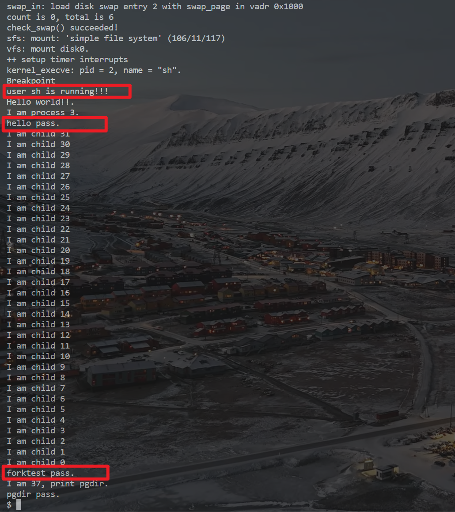

# lab8 report

## 基础部分

### 练习1: 完成读文件操作的实现

> 首先了解打开文件的处理流程，然后参考本实验后续的文件读写操作的过程分析，填写在 kern/fs/sfs/sfs_inode.c 中 的 sfs_io_nolock()函数，实现读文件中数据的代码。

#### 打开文件处理流程

经过 syscall.c 的处理之后，进入内核态，首先执行 sysfile_open() 函数, `sysfile_open` 函数首先将路径字符串复制到内核空间，再调用 `file_open` 函数，分析该函数：


1. 在函数 `file_open` 内，完成
   - 根据 `open_flags` 提取文件打开权限；
   - 调用 `fd_array_alloc` 从 fd_array 数组中取得一个空闲 file 项；
   - 调用 `vfs_open` 从 file system 获得目标路径对应的 inode；
   - 根据是否为 **append** 模式调用 `vop_fstat` 获得inode 信息, 并设置 file 的位置；
   - 将此 file 的成员变量 node 指针指向一个代表此文件的 inode 的起始地址。
2. 在函数 `fd_array_alloc` 中从 fd_array 数组中取得一个空闲 file 项
    - 调用 `get_fd_array` 从当前的进程的 files_struct 中获得 file 数组
    - 根据 fd 参数确认是寻找一个未分配 file 对象还是查找特定偏移的 file 对象
3. 在函数 `vfs_open` 中从 file system 获得目标路径对应的 inode；
   - 首先通过 `open_flags` 确定文件打开权限
   - 调用 `vfs_lookup` 通过文件路径名获得 inode
     - 调用 `get_device` 解析文件路径并选择相应的文件系统节点 inode, 具体完成以下操作：
       - 设备名称的提取
       - 相对路径和绝对路径的处理
       - 如果没有冒号并且路径以斜杠开头，那么这个路径被视为相对于当前目录的相对路径，函数会将整个路径视为子路径，并从当前目录开始查找。
       - 如果存在冒号，那么这个路径被视为相对于某个设备的绝对路径。函数会找到设备的根目录，并将从设备根目录开始的路径视为子路径。
       - 文件系统节点存储：通过`struct inode **node_store`参数返回找到的文件系统节点。
       - 对于以斜杠开头的路径，函数会将其视为相对于引导文件系统的路径。对于以冒号开头的路径，函数会将其视为相对于当前文件系统的路径。


> index node 是位于内存的索引节点，它是 VFS 结构中的重要数据结构，因为它实际负责把不同文件系统的特定索引节点信息（甚至不能算是一个索引节点）统一封装起来，避免了进程直接访问具体文件系统。

#### 代码实现

```c
// kern/fs/sfs/sfs_inode.c
// sfs_io_nolock 实现
// Rd/Wr a file contentfrom offset position to offset+ length  disk blocks<-->buffer (in memroy)
static int
sfs_io_nolock(struct sfs_fs *sfs, struct sfs_inode *sin, void *buf, off_t offset, size_t *alenp, bool write) {
    struct sfs_disk_inode *din = sin->din;
    assert(din->type != SFS_TYPE_DIR);
    off_t endpos = offset + *alenp, blkoff;
    *alenp = 0;
	// calculate the Rd/Wr end position
    if (offset < 0 || offset >= SFS_MAX_FILE_SIZE || offset > endpos) {
        return -E_INVAL;
    }
    if (offset == endpos) {
        return 0;
    }
    if (endpos > SFS_MAX_FILE_SIZE) {
        endpos = SFS_MAX_FILE_SIZE;
    }
    if (!write) {
        if (offset >= din->size) {
            return 0;
        }
        if (endpos > din->size) {
            endpos = din->size;
        }
    }

    int (*sfs_buf_op)(struct sfs_fs *sfs, void *buf, size_t len, uint32_t blkno, off_t offset);
    int (*sfs_block_op)(struct sfs_fs *sfs, void *buf, uint32_t blkno, uint32_t nblks);
    if (write) {
        sfs_buf_op = sfs_wbuf, sfs_block_op = sfs_wblock;
    }
    else {
        sfs_buf_op = sfs_rbuf, sfs_block_op = sfs_rblock;
    }

    int ret = 0;
    size_t size, alen = 0;
    uint32_t ino;
    uint32_t blkno = offset / SFS_BLKSIZE;          // The NO. of Rd/Wr begin block
    uint32_t nblks = endpos / SFS_BLKSIZE - blkno;  // The size of Rd/Wr blocks

  //LAB8:EXERCISE1 2113302 HINT: call sfs_bmap_load_nolock, sfs_rbuf, sfs_rblock,etc. read different kind of blocks in file
	/*
	 * (1) If offset isn't aligned with the first block, Rd/Wr some content from offset to the end of the first block
	 *       NOTICE: useful function: sfs_bmap_load_nolock, sfs_buf_op
	 *               Rd/Wr size = (nblks != 0) ? (SFS_BLKSIZE - blkoff) : (endpos - offset)
	 * (2) Rd/Wr aligned blocks 
	 *       NOTICE: useful function: sfs_bmap_load_nolock, sfs_block_op
     * (3) If end position isn't aligned with the last block, Rd/Wr some content from begin to the (endpos % SFS_BLKSIZE) of the last block
	 *       NOTICE: useful function: sfs_bmap_load_nolock, sfs_buf_op	
	*/

    // If offset isn't aligned with the first block
    if ((blkoff = offset % SFS_BLKSIZE) != 0) {
        size = (nblks != 0) ? (SFS_BLKSIZE - blkoff) : (endpos - offset);
        // according to the DIR's inode and the logical index of block in inode, find the NO. of disk block.
        if ((ret = sfs_bmap_load_nolock(sfs, sin, blkno, &ino)) != 0) {
            goto out;
        }
        // Rd/Wr some content from offset to the end of the first block
        if ((ret = sfs_buf_op(sfs, buf, size, ino, blkoff)) != 0) {
            goto out;
        }

        alen += size;
        buf += size;

        if (nblks == 0) {
            goto out;
        }

        blkno++;
        nblks--;
    }
    // Rd/Wr aligned blocks 
    if (nblks > 0) {
        if ((ret = sfs_bmap_load_nolock(sfs, sin, blkno, &ino)) != 0) {
            goto out;
        }
        if ((ret = sfs_block_op(sfs, buf, ino, nblks)) != 0) {
            goto out;
        }

        alen += nblks * SFS_BLKSIZE;
        buf += nblks * SFS_BLKSIZE;
        blkno += nblks;
        nblks -= nblks;
    }
    // If end position isn't aligned with the last block
    if ((size = endpos % SFS_BLKSIZE) != 0) {
        if ((ret = sfs_bmap_load_nolock(sfs, sin, blkno, &ino)) != 0) {
            goto out;
        }
        if ((ret = sfs_buf_op(sfs, buf, size, ino, 0)) != 0) {
            goto out;
        }
        alen += size;
    }

out:
    *alenp = alen;
    if (offset + alen > sin->din->size) {
        sin->din->size = offset + alen;
        sin->dirty = 1;
    }
    return ret;
}

```

### 练习2: 完成基于文件系统的执行程序机制的实现

> 改写 proc.c 中的 load_icode 函数和其他相关函数，实现基于文件系统的执行程序机制。执行：make qemu。如果能看看到 sh 用户程序的执行界面，则基本成功了。如果在sh用户界面上可以执行 ”hello” 等其他放置在 sfs 文件系统中的其他执行程序，则可以认为本实验基本成功。

#### 代码实现

1. 为当前进程创建一个新的mm
2. 创建一个新的PDT，且mm->pgdir=PDT的内核虚拟地址
3. 将TEXT/DATA/BSS部分以二进制形式复制到进程的内存空间
   1. 读取文件中的原始数据内容并解析elfhdr
   2. 读取文件中的原始数据内容并根据elfhdr中的信息解析proghdr
   3. 调用mm_map构建TEXT/DATA相关的vma
   4. 调用pgdir_alloc_page为TEXT/DATA分配页面，读取文件内容并将它们复制到新分配的页面中
   5. 调用pgdir_alloc_page为BSS分配页面，这些页面中memset为零
4. 调用mm_map设置用户栈，并将参数放入用户栈
5. 设置当前进程的mm,cr3,重置pgidr(使用lcr3 MARCO)
6. 在用户栈中设置uargc和uargv
7. 设置用户环境的trapframe
8. 向上步骤失败时清理环境。

```cpp
static int
load_icode(int fd, int argc, char **kargv) {
    /* LAB8:EXERCISE2 2113302  HINT:how to load the file with handler fd  in to process's memory? how to setup argc/argv?
     * MACROs or Functions:
     *  mm_create        - create a mm
     *  setup_pgdir      - setup pgdir in mm
     *  load_icode_read  - read raw data content of program file
     *  mm_map           - build new vma
     *  pgdir_alloc_page - allocate new memory for  TEXT/DATA/BSS/stack parts
     *  lcr3             - update Page Directory Addr Register -- CR3
     */
  /* (1) create a new mm for current process
     * (2) create a new PDT, and mm->pgdir= kernel virtual addr of PDT
     * (3) copy TEXT/DATA/BSS parts in binary to memory space of process
     *    (3.1) read raw data content in file and resolve elfhdr
     *    (3.2) read raw data content in file and resolve proghdr based on info in elfhdr
     *    (3.3) call mm_map to build vma related to TEXT/DATA
     *    (3.4) callpgdir_alloc_page to allocate page for TEXT/DATA, read contents in file
     *          and copy them into the new allocated pages
     *    (3.5) callpgdir_alloc_page to allocate pages for BSS, memset zero in these pages
     * (4) call mm_map to setup user stack, and put parameters into user stack
     * (5) setup current process's mm, cr3, reset pgidr (using lcr3 MARCO)
     * (6) setup uargc and uargv in user stacks
     * (7) setup trapframe for user environment
     * (8) if up steps failed, you should cleanup the env.
     */
    assert(argc >= 0 && argc <= EXEC_MAX_ARG_NUM);

    if (current->mm != NULL) {
        panic("load_icode: current->mm must be empty.\n");
    }

    int ret = -E_NO_MEM;
    struct mm_struct *mm;
    // 当前进程创建一个新的mm
    if ((mm = mm_create()) == NULL) {
        goto bad_mm;
    }
    // 创建一个新的PDT，且 mm->pgdir = PDT的内核虚拟地址
    if (setup_pgdir(mm) != 0) {
        goto bad_pgdir_cleanup_mm;
    }

    struct Page *page;

    struct elfhdr __eh, *eh = &__eh;
    // 读取 elf 文件头
    if ((ret = load_icode_read(fd, eh, sizeof(struct elfhdr), 0)) != 0) {
        goto bad_elf_cleanup_pgdir;
    }
    // 确定魔数正确
    if (eh->e_magic != ELF_MAGIC) {
        ret = -E_INVAL_ELF;
        goto bad_elf_cleanup_pgdir;
    }
    struct proghdr __ph, *ph = &__ph;
    uint32_t vm_flags, perm, phnum;
    for (phnum = 0; phnum < eh->e_phnum; phnum ++) {
        off_t phoff = eh->e_phoff + sizeof(struct proghdr) * phnum;
        // 读取文件中的原始数据内容并根据elfhdr中的信息解析proghdr
        if ((ret = load_icode_read(fd, ph, sizeof(struct proghdr), phoff)) != 0) {
            goto bad_cleanup_mmap;
        }
        if (ph->p_type != ELF_PT_LOAD) {
            continue ;
        }
        if (ph->p_filesz > ph->p_memsz) {
            ret = -E_INVAL_ELF;
            goto bad_cleanup_mmap;
        }
        if (ph->p_filesz == 0) {
            // continue ;
            // do nothing here since static variables may not occupy any space
        }
        vm_flags = 0, perm = PTE_U | PTE_V;
        if (ph->p_flags & ELF_PF_X) vm_flags |= VM_EXEC;
        if (ph->p_flags & ELF_PF_W) vm_flags |= VM_WRITE;
        if (ph->p_flags & ELF_PF_R) vm_flags |= VM_READ;
        // modify the perm bits here for RISC-V
        if (vm_flags & VM_READ) perm |= PTE_R;
        if (vm_flags & VM_WRITE) perm |= (PTE_W | PTE_R);
        if (vm_flags & VM_EXEC) perm |= PTE_X;
        
        // 调用mm_map构建TEXT/DATA相关的vma
        if ((ret = mm_map(mm, ph->p_va, ph->p_memsz, vm_flags, NULL)) != 0) {
            goto bad_cleanup_mmap;
        }
        off_t offset = ph->p_offset;
        size_t off, size;
        uintptr_t start = ph->p_va, end, la = ROUNDDOWN(start, PGSIZE);

        ret = -E_NO_MEM;

        end = ph->p_va + ph->p_filesz;
        while (start < end) {
            if ((page = pgdir_alloc_page(mm->pgdir, la, perm)) == NULL) {
                ret = -E_NO_MEM;
                goto bad_cleanup_mmap;
            }
            off = start - la, size = PGSIZE - off, la += PGSIZE;
            if (end < la) {
                size -= la - end;
            }
            if ((ret = load_icode_read(fd, page2kva(page) + off, size, offset)) != 0) {
                goto bad_cleanup_mmap;
            }
            start += size, offset += size;
        }
        end = ph->p_va + ph->p_memsz;

        if (start < la) {
            /* ph->p_memsz == ph->p_filesz */
            if (start == end) {
                continue ;
            }
            off = start + PGSIZE - la, size = PGSIZE - off;
            if (end < la) {
                size -= la - end;
            }
            
            // 调用pgdir_alloc_page为BSS分配页面，这些页面中memset为零
            memset(page2kva(page) + off, 0, size);
            start += size;
            assert((end < la && start == end) || (end >= la && start == la));
        }
        while (start < end) {
            if ((page = pgdir_alloc_page(mm->pgdir, la, perm)) == NULL) {
                ret = -E_NO_MEM;
                goto bad_cleanup_mmap;
            }
            off = start - la, size = PGSIZE - off, la += PGSIZE;
            if (end < la) {
                size -= la - end;
            }
            memset(page2kva(page) + off, 0, size);
            start += size;
        }
    }
    sysfile_close(fd);

    vm_flags = VM_READ | VM_WRITE | VM_STACK;
    // 调用mm_map设置用户栈，并将参数放入用户栈
    if ((ret = mm_map(mm, USTACKTOP - USTACKSIZE, USTACKSIZE, vm_flags, NULL)) != 0) {
        goto bad_cleanup_mmap;
    }
    assert(pgdir_alloc_page(mm->pgdir, USTACKTOP-PGSIZE , PTE_USER) != NULL);
    assert(pgdir_alloc_page(mm->pgdir, USTACKTOP-2*PGSIZE , PTE_USER) != NULL);
    assert(pgdir_alloc_page(mm->pgdir, USTACKTOP-3*PGSIZE , PTE_USER) != NULL);
    assert(pgdir_alloc_page(mm->pgdir, USTACKTOP-4*PGSIZE , PTE_USER) != NULL);
    
    // 设置当前进程的mm,cr3,重置pgidr(使用lcr3 MARCO)
    mm_count_inc(mm);
    current->mm = mm;
    current->cr3 = PADDR(mm->pgdir);
    lcr3(PADDR(mm->pgdir));

    // 在用户栈中设置uargc和uargv
    uint32_t argv_size=0, i;
    for (i = 0; i < argc; i ++) {
        argv_size += strnlen(kargv[i],EXEC_MAX_ARG_LEN + 1)+1;
    }

    uintptr_t stacktop = USTACKTOP - (argv_size/sizeof(long)+1)*sizeof(long);
    char** uargv=(char **)(stacktop  - argc * sizeof(char *));
    
    argv_size = 0;
    for (i = 0; i < argc; i ++) {
        uargv[i] = strcpy((char *)(stacktop + argv_size ), kargv[i]);
        argv_size +=  strnlen(kargv[i],EXEC_MAX_ARG_LEN + 1)+1;
    }
    
    stacktop = (uintptr_t)uargv - sizeof(int);
    *(int *)stacktop = argc;
    
    // 设置用户环境的trapframe
    struct trapframe *tf = current->tf;
    uintptr_t sstatus = tf->status;
    memset(tf, 0, sizeof(struct trapframe));
    tf->gpr.sp = stacktop;
    tf->epc = eh->e_entry;
    tf->status = sstatus & ~(SSTATUS_SPP | SSTATUS_SPIE);
    ret = 0;
out:
    return ret;
// 清理环境
bad_cleanup_mmap:
    exit_mmap(mm);
bad_elf_cleanup_pgdir:
    put_pgdir(mm);
bad_pgdir_cleanup_mm:
    mm_destroy(mm);
bad_mm:
    goto out;
}
```

#### 运行截图

> 简单地测试了两个程序并截图附在报告中
> 

## 扩展练习 

### Challenge1：完成基于“UNIX的PIPE机制”的设计方案

> 如果要在ucore里加入UNIX的管道(Pipe)机制，至少需要定义哪些数据结构和接口？（接口给出语义即可，不必具体实现。数据结构的设计应当给出一个(或多个)具体的C语言struct定义。
>
> 在网络上查找相关的Linux资料和实现，请在实验报告中给出设计实现”UNIX的PIPE机制“的概要设方案，你的设计应当体现出对可能出现的同步互斥问题的处理。

#### pipe 读写特点

管道实际上可以实现一个**半双工通信**的机制。使用同一个管道的父子进程可以分时给对方发送消息。对管道读写的一些特点总结：

1. 在管道中没有数据的情况下，对管道的读操作会阻塞，直到管道内有数据为止。当一次写的数据量不超过管道容量的时候，对管道的写操作一般不会阻塞，直接将要写的数据写入管道缓冲区即可。
2. 写操作也不会在所有情况下都不阻塞。管道实际上就是内核控制的一个内存缓冲区，既然是缓冲区，就有容量上限。将管道一次最多可以缓存的数据量大小叫做 PIPESIZE。内核在处理管道数据的时候，底层也要调用类似 read 和 write 这样的方法进行数据拷贝，这种内核操作每次可以操作的数据量也是有限的，一般的操作长度为一个page，即默认为4k字节。一般将每次可以操作的数据量长度叫做PIPEBUF。POSIX 标准中，对PIPEBUF有长度限制，要求其最小长度不得低于512字节。

> PIPEBUF 的作用是，内核在处理管道的时候，如果每次读写操作的数据长度不大于PIPEBUF时，保证其操作是原子的。而PIPESIZE的影响是，大于其长度的写操作会被阻塞，直到当前管道中的数据被读取为止。

#### 数据结构设计

按照 ”一切皆文件“ 的思想设计，设计 pipe 类似与文件的创建，分析管道的作用主要是用于进程间通信，且需要考虑读写互斥的问题需要设置等待队列，因此设计单个 pipe 数据节点如下：

```cpp
struct pipe_inode_info {
    wait_queue_head_t wait;//存储等待读写进程的等待队列
    unsigned int nrbufs, curbuf;
    /* nrbufs: 写入但还未被读取的数据占用缓冲区的页数
       curbuf：当前正在读取环形缓冲区中的页节点
    */
    struct page *tmp_page; //临时缓冲区页面
    unsigned int readers; //正在读取pipe的读进程数目
    unsigned int writers; //正在写pipe的写进程数目
    unsigned int waiting_writers; //等待管道可以写的进程数目
    struct inode *inode; //pipe 对应的inode结构
    struct pipe_buffer bufs[PIPE_BUFFERS]; //环形缓冲区，每个元素对应一个内存页
};
```

读管道时：
1. 先锁定内存。
2. 从缓冲区中获取数据页，把页中数据拷贝到用户缓冲区中。
3. 数据全部被读完，则发送信号唤醒写进程，同时读进程让出 CPU 进行休眠。

写管道时：
1. 先锁定内存。
2. 获取可写的缓冲区，若可写则循环写。
3. 若不可写，则唤醒读进程，同时写进程进行休眠，让出 CPU。

### Challenge2：完成基于“UNIX的软连接和硬连接机制”的设计方案

> 如果要在ucore里加入UNIX的软连接和硬连接机制，至少需要定义哪些数据结构和接口？（接口给出语义即可，不必具体实现。数据结构的设计应当给出一个(或多个)具体的C语言struct定义。
>
> 在网络上查找相关的Linux资料和实现，请在实验报告中给出设计实现”UNIX的软连接和硬连接机制“的概要设方案，你的设计应当体现出对可能出现的同步互斥问题的处理.

#### 硬链接

##### 硬链接的原理

硬链接是指在同一个文件系统中，将一个文件名关联到一个已经存在的文件上，使得该文件名也可以访问该文件。**硬链接与原文件共享inode**，即它们有相同的inode号和相同的device号。因此，对于硬链接和原文件来说，它们的访问权限、所有者、大小等属性都是相同的。

##### 硬链接的实现

硬链接既然共享一个 inode, 那其实实现比较简单，只需要创建一个对应新文件名的 dentry, inode 成员变量的引用计数在每多一个 dentry 链接到它的时候 +1, 删除时 -1, 当引用计数归零时删除空间。 

#### 软链接

##### 软链接的原理

软链接（也称符号链接）是指在不同的文件系统之间，将一个文件名关联到另一个文件上，使得该文件名也可以访问该文件。**软链接与原文件不共享inode**，它们有不同的inode号和device号。因此，对于软链接和原文件来说，它们的访问权限、所有者、大小等属性可能不同。

##### 软链接的实现

软链接为链接文件创建一个inode结构，其中存放文件名、目标文件的inode号、访问权限和时间戳等。这些信息用于标识软链接本身以及链接指向的目标文件。而为软链接创建的 dentry 则不指向目标的 inode, 而指向新创建的 inode.


